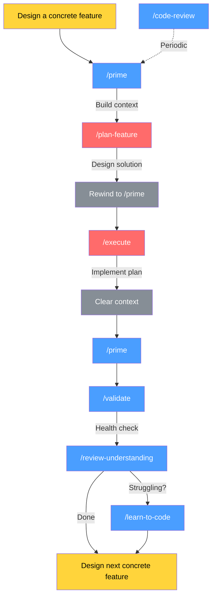

# AI-Assisted Development Workflow

A set of Claude Code skills that form a structured development loop: understand the codebase, plan the work, implement it, then verify both the code and your own understanding.

This workflow is inspired by [Compound Engineering](https://every.to/chain-of-thought/compound-engineering-how-every-codes-with-agents), especially the workflow of plan, execute, and validate. The compound part is in reflecting after each loop and determining if the loop itself is working as intended, editing the skills and workflow as needed with lessons learned each time. 

Concrete features should be clear-cut and achievable in one session. "Add a button that sends a request to the backend and returns a calculated grid" is a good example, "make the interface feel better to people" might not be. Coming up with concrete features first requires design work, which is outside of the scope of these skills.

## Workflow

**Legend:** 🔴 Opus — 🔵 Sonnet — 🟡 User action

### Why rewind and clear?

- **Rewind to prime** after planning — execute sees only the codebase context and the plan file, not the exploratory back-and-forth from planning. Cleaner context, better output.
- **Clear after execution** — validation and review run against the actual code changes, not the conversation that produced them. Fresh eyes.

## Skills Reference

| Skill | Purpose | Recommended Model | Why |
|---|---|---|---|
| `/prime` | Load project structure, entry points, recent git state | **Sonnet** | Retrieval and summarization — no architectural reasoning needed |
| `/plan-feature` | Analyze codebase, design solution, write implementation plan | **Opus** | Architectural decisions and trade-offs compound downstream |
| `/execute` | Implement plan task-by-task with validation at each step | **Opus** | Code quality here determines rework cost |
| `/validate` | Run lints, type checks, builds, and tests; report pass/fail | **Sonnet / Haiku** | Mechanical — run commands, report results |
| `/review-understanding` | Summarize changes, ask comprehension questions | **Sonnet** | Needs good question formulation, not deep generation |
| `/learn-to-code` | Guided I Do / We Do / You Do coding lesson | **Sonnet** | Explanation quality matters but concepts are bounded |
| `/code-review` | Review diffs for bugs, security, performance, pattern violations | **Sonnet** | Solid reasoning; upgrade to Opus for deep architectural review |

