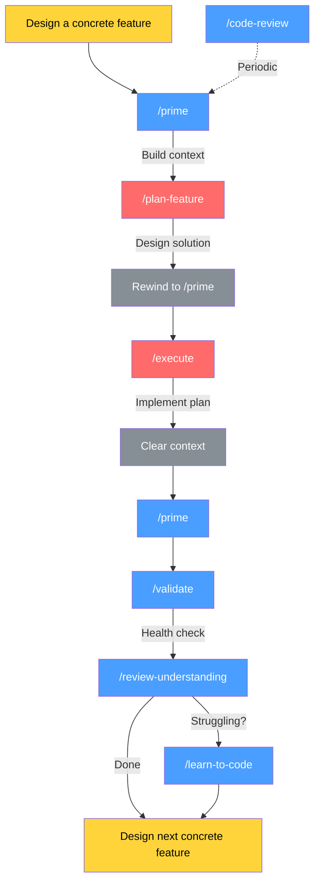

# AI-Assisted Development Workflow

A set of Claude Code skills that form a structured development loop: understand the codebase, plan the work, implement it, then verify both the code and your own understanding.

This workflow is inspired by [Compound Engineering](https://every.to/chain-of-thought/compound-engineering-how-every-codes-with-agents), especially the workflow of plan, execute, and validate. The compound part is in reflecting after each loop and determining if the loop itself is working as intended, editing the skills and workflow as needed with lessons learned each time. 

Concrete features should be clear-cut and achievable in one session. "Add a button that sends a request to the backend and returns a calculated grid" is a good example, "make the interface feel better to people" might not be. Coming up with concrete features first requires design work, which is outside of the scope of these skills.

## Workflow

**Legend:** 🔴 Opus — 🔵 Sonnet — 🟡 User action

```mermaid
graph TD
    Z["Design a concrete feature"] --> A["/prime"]
    A -->|"Build context"| B["/plan-feature"]
    B -->|"Design solution"| C["Rewind to /prime"]
    C --> D["/execute"]
    D -->|"Implement plan"| E["Clear context"]
    E --> F["/prime"]
    F --> G["/validate"]
    G -->|"Health check"| H["/review-understanding"]
    H -->|"Struggling?"| I["/learn-to-code"]
    H -->|"Done"| J["Design next concrete feature"]
    I --> J

    K["/code-review"] -.->|"Periodic"| A

    style Z fill:#ffd43b,color:#000
    style A fill:#4a9eff,color:#fff
    style B fill:#ff6b6b,color:#fff
    style C fill:#868e96,color:#fff
    style D fill:#ff6b6b,color:#fff
    style E fill:#868e96,color:#fff
    style F fill:#4a9eff,color:#fff
    style G fill:#4a9eff,color:#fff
    style H fill:#4a9eff,color:#fff
    style I fill:#4a9eff,color:#fff
    style J fill:#ffd43b,color:#000
    style K fill:#4a9eff,color:#fff
```


### Why rewind and clear?

- **Rewind to prime** after planning — execute sees only the codebase context and the plan file, not the exploratory back-and-forth from planning. Cleaner context, better output.
- **Clear after execution** — validation and review run against the actual code changes, not the conversation that produced them. Fresh eyes.

## Skills Reference

| Skill | Purpose | Recommended Model | Why |
|---|---|---|---|
| `/prime` | Load project structure, entry points, recent git state | **Sonnet** | Retrieval and summarization — no architectural reasoning needed |
| `/plan-feature` | Analyze codebase, design solution, write implementation plan | **Opus** | Architectural decisions and trade-offs compound downstream |
| `/execute` | Implement plan task-by-task with validation at each step | **Opus** | Code quality here determines rework cost |
| `/validate` | Run lints, type checks, builds, and tests; report pass/fail | **Sonnet / Haiku** | Mechanical — run commands, report results |
| `/review-understanding` | Summarize changes, ask comprehension questions | **Sonnet** | Needs good question formulation, not deep generation |
| `/learn-to-code` | Guided I Do / We Do / You Do coding lesson | **Sonnet** | Explanation quality matters but concepts are bounded |
| `/code-review` | Review diffs for bugs, security, performance, pattern violations | **Sonnet** | Solid reasoning; upgrade to Opus for deep architectural review |
| `/dispatch` | Supervise plan → execute → validate as isolated subagents for one high-confidence task | **Sonnet** (supervisor) | Orchestration only; spawns Fable subagents (Opus fallback) for the heavy stages |
| `/dispatch-interactive` | Same supervisor loop, but pauses for your go/edit/redo at every stage | **Sonnet** (supervisor) | Human-in-the-loop variant for fuzzy work; still spawns Fable subagents (Opus fallback) |

## Supervisor fast path (`/dispatch`)

For **high-confidence, single-session** tasks, `/dispatch` folds the manual loop into one orchestrated run: a thin Sonnet supervisor dispatches **isolated subagents** for plan (Fable, Opus fallback) → execute (Fable, Opus fallback) → validate (Sonnet), each reading the skills above and handing off via files, then shows you the diff and runs `/review-understanding`. Reserve it for work you don't need to learn from — the manual loop stays the default for everything else, since subagents can't ask you questions mid-run.

It is deliberately **interactive, not headless** (`claude -p`): after **2026-06-15**, programmatic usage bills from a small separate monthly credit at full API rates, while interactive worktree sessions stay on your subscription's subsidized limits.

### Launcher: `bin/claude-dispatch`

A skill can't create its own session, so `bin/claude-dispatch` bootstraps the worktree + tmux session that `/dispatch` runs inside:

```
claude-dispatch <repo-name-or-path> <issue-number> [approach-suffix]

claude-dispatch gelos-lc 26              # worktree issue-26
claude-dispatch gelos-lc 26 approachB    # issue-26-approachB — fan out a second attempt on the same issue
```

It resolves the issue via `gh`, then creates the tmux session itself — `tmux new-session -d -s disp-issue-N` running `claude --worktree issue-N --model sonnet --permission-mode bypassPermissions "/dispatch #N"` — and attaches (or switches, if you're already inside tmux). Naming the session `disp-<worktree>` makes it findable in `tmux attach -t` and the `Ctrl-b s` picker. Bare repo names resolve against `DISPATCH_REPO_ROOTS` (colon-separated; defaults to the local workspace); pass a full path otherwise. `-p <paired-repo>` also creates a matching `issue-N` worktree in a second repo, for testing cross-repo changes together. Inside an existing worktree session, skip the launcher and type `/dispatch #26` directly.

**Install:** see [Installing on a new machine](#installing-on-a-new-machine) below.

### Stay in the loop: `bin/claude-dispatch-i`

The human-in-the-loop twin of `claude-dispatch`. Identical bootstrap (worktree + tmux + `gh` lookup, `--model sonnet --permission-mode bypassPermissions`, same `issue-N[-suffix]` worktree/branch naming), but it launches `/dispatch-interactive`, which **stops after each stage** — scope, plan, diff, validation — for your approve / edit / redo, folding your feedback into a fresh subagent re-dispatch. Autonomous `/dispatch` gates only on failure; reach for `-i` when the work is fuzzy or you want to learn from it.

```
claude-dispatch-i <repo-name-or-path> <issue-number> [approach-suffix]
```

The only naming difference is the tmux session **prefix** — `pair-issue-N` instead of `disp-issue-N` — so you can tell interactive from autonomous runs at a glance. Because the worktree/branch names match, `claude-dispatch-ls` and `claude-dispatch-clean` manage these runs unchanged. The launcher refuses to start if either a `pair-` or a `disp-` session already owns the worktree — one mode per worktree.

### List and clean up: `bin/claude-dispatch-ls` / `bin/claude-dispatch-clean`

Once you fan out across several worktrees, these manage the fleet.

`claude-dispatch-ls [repo]` maps every dispatch worktree to its live tmux session (if any) and flags the two footguns: an **`idle*`** worktree (no session but holds uncommitted or un-merged work) and a **dangling branch** whose worktree dir is already gone — removing a worktree dir does *not* delete its `worktree-*` branch. No arg scans the repo you're standing in, every repo under `DISPATCH_REPO_ROOTS`, and every repo the launchers have recorded in the registry at `~/.local/share/claude-dispatch/repos` — so past dispatch repos stay discoverable after a reboot even with no env var set.

```
claude-dispatch-ls                     # STATE / SESSION / REPO / WORKTREE / BRANCH / AHEAD / DIRTY
claude-dispatch-clean <repo> <issue> [approach-suffix] [-y] [--force]
```

`claude-dispatch-clean` tears a run down in order — kill the session, remove the worktree, delete the branch, prune. It **refuses** to discard a worktree/branch with uncommitted or un-merged (`ahead>0`) work unless you pass `--force`, and handles the branch-only case when the dir is already gone. `-y` skips the confirm prompt. A paired worktree made with `-p` is a separate run to clean: `claude-dispatch-clean <paired-repo> <issue>` (it deletes whatever branch the worktree has checked out, so the paired repo's `issue-N` branch is handled too).

### Recover after a restart: `bin/claude-dispatch-resume`

tmux only hosts the shell — a reboot (or anything that kills the tmux server) tears down your dispatch sessions. But Claude Code persists every conversation to `~/.claude/projects/<encoded-worktree-path>/*.jsonl`, so the work isn't lost: you **resume** the saved session instead of restarting `/dispatch` from scratch (which would discard the in-flight plan/execute state).

`bin/claude-dispatch-resume` automates that recovery. For each dispatch worktree with no live session, it finds the latest saved `sessionId` and recreates the original `disp-<worktree>` tmux session running `claude --resume <id>` (same `--model sonnet --permission-mode bypassPermissions`, cwd set to the worktree):

```
claude-dispatch-resume [repo-name-or-path] [issue [approach-suffix]]

claude-dispatch-resume                 # revive every orphaned dispatch worktree it can find
claude-dispatch-resume gelos-lc        # only that repo's worktrees
claude-dispatch-resume gelos-lc 13     # only worktree issue-13[-suffix]
```

It **detaches** (it may revive several at once) and prints a `tmux attach -t …` line per session. A resumed session reloads its history and waits at the prompt — attach and type `continue` to pick up where it left off. Worktrees with no saved transcript are skipped (start those fresh with `claude-dispatch`), as are worktrees that already have a live `disp-` or `pair-` session. Bare repo names resolve as for `claude-dispatch`, and with no repo argument it also sweeps every repo in the `~/.local/share/claude-dispatch/repos` registry — the usual case after a reboot. `DISPATCH_RESUME_MODEL` overrides the model it relaunches with (default `sonnet`).

## Installing on a new machine

Everything the workflow needs lives in this repo; setup is a clone plus a few symlinks.

**1. Prerequisites**

- [Claude Code](https://claude.com/claude-code) CLI, logged in (`claude` on your `PATH`)
- `git`, `tmux`, and the GitHub CLI `gh` — run `gh auth login` for the account that can read your repos' issues
- `column` (usually preinstalled; package `util-linux` or `bsdmainutils`)

**2. Clone to `~/.claude/skills`.** This exact path matters twice: Claude Code auto-discovers each `*/SKILL.md` there as a user-level slash command, and the dispatch skills reference their stage skills by literal `~/.claude/skills/...` paths.

```
git clone https://github.com/DWGodwin/skills.git ~/.claude/skills
```

If `~/.claude/skills` already exists with skills you want to keep, move it aside first and merge afterwards.

**3. Put the launchers on your `PATH`:**

```
mkdir -p ~/.local/bin
for f in claude-dispatch claude-dispatch-i claude-dispatch-ls claude-dispatch-clean claude-dispatch-resume; do
  ln -s ~/.claude/skills/bin/$f ~/.local/bin/$f
done
```

Confirm `~/.local/bin` is on your `PATH` (most distros add it via `.profile` when the dir exists — re-login if you just created it).

**4. Point the tools at your repos** (optional). In your shell profile:

```
export DISPATCH_REPO_ROOTS="/path/to/workspace:/another/root"   # default: ~/workspace
```

Bare repo names (`claude-dispatch myrepo 12`) resolve against the directory you run from, the enclosing repo's parent, then these roots. Every launch also records its repo path in `~/.local/share/claude-dispatch/repos`, so `ls`/`clean`/`resume` keep finding your repos after a reboot even without this variable.

**5. Smoke test:**

```
claude-dispatch-ls           # prints "No dispatch worktrees..." — an error means PATH/deps aren't right
claude-dispatch <repo> <N>   # any repo with a GitHub remote and an open issue N
```

The only per-repo requirement is a GitHub remote `gh` can see (for the issue lookup). Worktrees are created under `<repo>/.claude/worktrees/`, which Claude Code manages.

