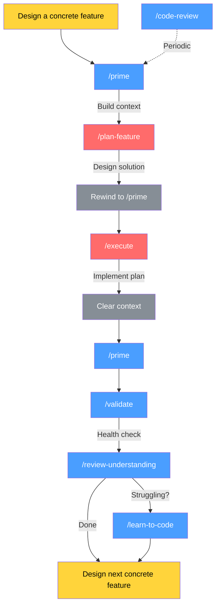

# AI-Assisted Development Workflow

A set of Claude Code skills that form a structured development loop: understand the codebase, plan the work, implement it, then verify both the code and your own understanding.

This workflow is inspired by [Compound Engineering](https://every.to/chain-of-thought/compound-engineering-how-every-codes-with-agents), especially the workflow of plan, execute, and validate. The compound part is in reflecting after each loop and determining if the loop itself is working as intended, editing the skills and workflow as needed with lessons learned each time. 

Concrete features should be clear-cut and achievable in one session. "Add a button that sends a request to the backend and returns a calculated grid" is a good example, "make the interface feel better to people" might not be. Coming up with concrete features first requires design work, which is outside of the scope of these skills.

## Workflow

**Legend:** 🔴 Opus — 🔵 Sonnet — 🟡 User action

```mermaid
graph TD
    Z["Design a concrete feature"] --> A["/prime"]
    A -->|"Build context"| B["/plan-feature"]
    B -->|"Design solution"| C["Rewind to /prime"]
    C --> D["/execute"]
    D -->|"Implement plan"| E["Clear context"]
    E --> F["/prime"]
    F --> G["/validate"]
    G -->|"Health check"| H["/review-understanding"]
    H -->|"Struggling?"| I["/learn-to-code"]
    H -->|"Done"| J["Design next concrete feature"]
    I --> J

    K["/code-review"] -.->|"Periodic"| A

    style Z fill:#ffd43b,color:#000
    style A fill:#4a9eff,color:#fff
    style B fill:#ff6b6b,color:#fff
    style C fill:#868e96,color:#fff
    style D fill:#ff6b6b,color:#fff
    style E fill:#868e96,color:#fff
    style F fill:#4a9eff,color:#fff
    style G fill:#4a9eff,color:#fff
    style H fill:#4a9eff,color:#fff
    style I fill:#4a9eff,color:#fff
    style J fill:#ffd43b,color:#000
    style K fill:#4a9eff,color:#fff
```


### Why rewind and clear?

- **Rewind to prime** after planning — execute sees only the codebase context and the plan file, not the exploratory back-and-forth from planning. Cleaner context, better output.
- **Clear after execution** — validation and review run against the actual code changes, not the conversation that produced them. Fresh eyes.

## Skills Reference

| Skill | Purpose | Recommended Model | Why |
|---|---|---|---|
| `/prime` | Load project structure, entry points, recent git state | **Sonnet** | Retrieval and summarization — no architectural reasoning needed |
| `/plan-feature` | Analyze codebase, design solution, write implementation plan | **Opus** | Architectural decisions and trade-offs compound downstream |
| `/execute` | Implement plan task-by-task with validation at each step | **Opus** | Code quality here determines rework cost |
| `/validate` | Run lints, type checks, builds, and tests; report pass/fail | **Sonnet / Haiku** | Mechanical — run commands, report results |
| `/review-understanding` | Summarize changes, ask comprehension questions | **Sonnet** | Needs good question formulation, not deep generation |
| `/learn-to-code` | Guided I Do / We Do / You Do coding lesson | **Sonnet** | Explanation quality matters but concepts are bounded |
| `/code-review` | Review diffs for bugs, security, performance, pattern violations | **Sonnet** | Solid reasoning; upgrade to Opus for deep architectural review |
| `/dispatch` | Supervise plan → execute → validate as isolated subagents for one high-confidence task | **Sonnet** (supervisor) | Orchestration only; spawns Fable subagents (Opus fallback) for the heavy stages |
| `/dispatch-interactive` | Same supervisor loop, but pauses for your go/edit/redo at every stage (`claude-dispatch new … -i`) | **Sonnet** (supervisor) | Human-in-the-loop variant for fuzzy work; still spawns Fable subagents (Opus fallback) |

## Supervisor fast path (`/dispatch`)

For **high-confidence, single-session** tasks, `/dispatch` folds the manual loop into one orchestrated run: a thin Sonnet supervisor dispatches **isolated subagents** for plan (Fable, Opus fallback) → execute (Fable, Opus fallback) → validate (Sonnet), each reading the skills above and handing off via files, then shows you the diff and runs `/review-understanding`. Reserve it for work you don't need to learn from — the manual loop stays the default for everything else, since subagents can't ask you questions mid-run.

It is deliberately **interactive, not headless** (`claude -p`): after **2026-06-15**, programmatic usage bills from a small separate monthly credit at full API rates, while interactive worktree sessions stay on your subscription's subsidized limits.

### Launcher: `bin/claude-dispatch`

A skill can't create its own worktree or window, so `bin/claude-dispatch` does the bootstrap. It fits a terminal-only workflow where [sesh](https://github.com/joshmedeski/sesh) keeps **one tmux session per repo**: each dispatch run is a **window** in that session, rooted in its own git worktree.

```
claude-dispatch new    <repo> <issue> [suffix] [-i]             start a run
claude-dispatch ls     [repo]                                   list runs
claude-dispatch resume [repo] [issue [suffix]]                  relaunch saved sessions
claude-dispatch clean  <repo> <issue> [suffix] [-y] [--force]   tear a run down

claude-dispatch new glooper 26              # worktree + window issue-26
claude-dispatch new glooper 26 approachB    # issue-26-approachB — fan out a second attempt
claude-dispatch new glooper 26 -i           # same, but /dispatch-interactive
claude-dispatch glooper 26                  # shorthand for `new`
```

`new` checks the issue exists via `gh`, creates the worktree with plain `git worktree add -b issue-N <repo>/.git/wt/issue-N main`, then opens a window named `issue-N` in the repo's project session (`sesh window connect`, which also starts the session if it isn't running) and attaches or switches to it. The window runs:

```
claude --remote-control <repo>/issue-N --name issue-N --model sonnet --permission-mode bypassPermissions "/dispatch #N"
```

`--remote-control` means every run shows up individually in [claude.ai/code](https://claude.ai/code) and the Claude mobile app as `<repo>/issue-N`, so you can watch or steer it away from the keyboard. `-i` launches `/dispatch-interactive` instead, which stops at every stage for your approve / edit / redo; `ls` shows the mode per window. Inside an existing worktree window, skip the launcher and type `/dispatch #26` directly.

**Why worktrees under `.git/wt/`:** git owns them (no `.gitignore` entry, no `.claude/worktrees` convention to remember), and search tools skip `.git` by default so the main checkout's `rg`/`fd` never see worktree copies. The worktree's branch is simply `issue-N[-suffix]`. Because the launcher never uses `claude --worktree`, the first launch in a new worktree shows Claude's workspace-trust prompt — accept it in the window.

Bare repo names resolve against the directory you run from, the enclosing repo's parent, `DISPATCH_REPO_ROOTS` (colon-separated; default `~/workspace`), then a registry of repos previous runs recorded. `DISPATCH_MODEL` overrides the supervisor model (default `sonnet`). Cross-repo work is two runs: `new` in each repo.

### List and clean up: `ls` / `clean`

```
claude-dispatch ls                     # STATE / WINDOW / MODE / REPO / WORKTREE / BRANCH / AHEAD / DIRTY
claude-dispatch clean glooper 26 [suffix] [-y] [--force]
```

`ls` maps every `.git/wt/` worktree to the tmux window sitting in it (as `session:window`) and flags the footguns: **`shell`** (a window is open there but claude isn't running — typically after a reboot, see `resume`), **`idle*`** (no window, but uncommitted or un-merged work), and **leftover `issue-*` branches** whose worktree is already gone. No arg scans the repo you're standing in, every repo under `DISPATCH_REPO_ROOTS`, and the registry.

`clean` kills the window, removes the worktree, deletes the branch and prunes. It **refuses** to discard uncommitted or un-merged (`ahead>0`) work unless you pass `--force`, and handles the branch-only case when the dir is already gone. `-y` skips the confirm prompt.

### Recover after a restart: `resume`

tmux-resurrect/continuum bring the project sessions and their windows back after a reboot, but not the `claude` process inside them. Claude Code persists every conversation to `~/.claude/projects/<encoded-worktree-path>/*.jsonl`, so nothing is lost — `resume` finds the latest saved session for each dispatch worktree and relaunches `claude --resume <id>` with the same Remote Control name and flags:

```
claude-dispatch resume                 # every dispatch worktree without a running claude
claude-dispatch resume glooper         # only that repo
claude-dispatch resume glooper 13      # only issue-13[-suffix]
```

If a window already sits in the worktree with a bare shell (what resurrect restores), the resume command is typed into it; otherwise a new window is opened in the background. Windows where claude is already running, or that are busy with something else, are skipped, as are worktrees with no saved transcript (start those fresh with `new`). A resumed session reloads its history and waits at the prompt — switch to the window and type `continue`.

## Installing on a new machine

Everything the workflow needs lives in this repo; setup is a clone plus a few symlinks.

**1. Prerequisites**

- [Claude Code](https://claude.com/claude-code) CLI, logged in (`claude` on your `PATH`)
- `git`, `tmux`, the GitHub CLI `gh` (run `gh auth login` for the account that can read your repos' issues), and [sesh](https://github.com/joshmedeski/sesh) ≥ 2.31 for the one-session-per-repo layout (without it the launcher falls back to plain `tmux` with the same naming)
- `column` (usually preinstalled; package `util-linux` or `bsdmainutils`)

**2. Clone to `~/.claude/skills`.** This exact path matters twice: Claude Code auto-discovers each `*/SKILL.md` there as a user-level slash command, and the dispatch skills reference their stage skills by literal `~/.claude/skills/...` paths.

```
git clone https://github.com/DWGodwin/skills.git ~/.claude/skills
```

If `~/.claude/skills` already exists with skills you want to keep, move it aside first and merge afterwards.

**3. Put the launcher on your `PATH`:**

```
mkdir -p ~/.local/bin
ln -s ~/.claude/skills/bin/claude-dispatch ~/.local/bin/claude-dispatch
```

Confirm `~/.local/bin` is on your `PATH` (most distros add it via `.profile` when the dir exists — re-login if you just created it).

**4. Point the tools at your repos** (optional). In your shell profile:

```
export DISPATCH_REPO_ROOTS="/path/to/workspace:/another/root"   # default: ~/workspace
```

Bare repo names (`claude-dispatch new myrepo 12`) resolve against the directory you run from, the enclosing repo's parent, then these roots. Every launch also records its repo path in `~/.local/share/claude-dispatch/repos`, so `ls`/`clean`/`resume` keep finding your repos after a reboot even without this variable.

**5. Smoke test:**

```
claude-dispatch ls               # prints "No dispatch worktrees..." — an error means PATH/deps aren't right
claude-dispatch new <repo> <N>   # any repo with a GitHub remote and an open issue N
```

The only per-repo requirement is a GitHub remote `gh` can see (for the issue lookup). Worktrees are created under `<repo>/.git/wt/` and managed with plain `git worktree`.

